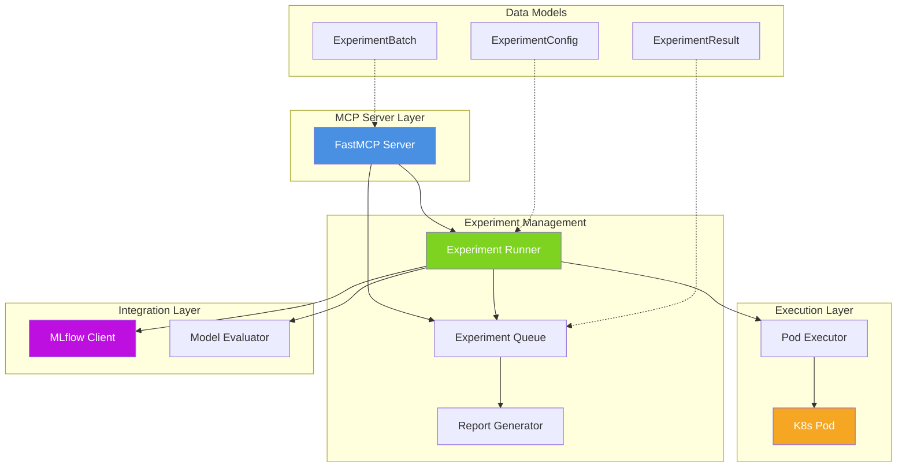
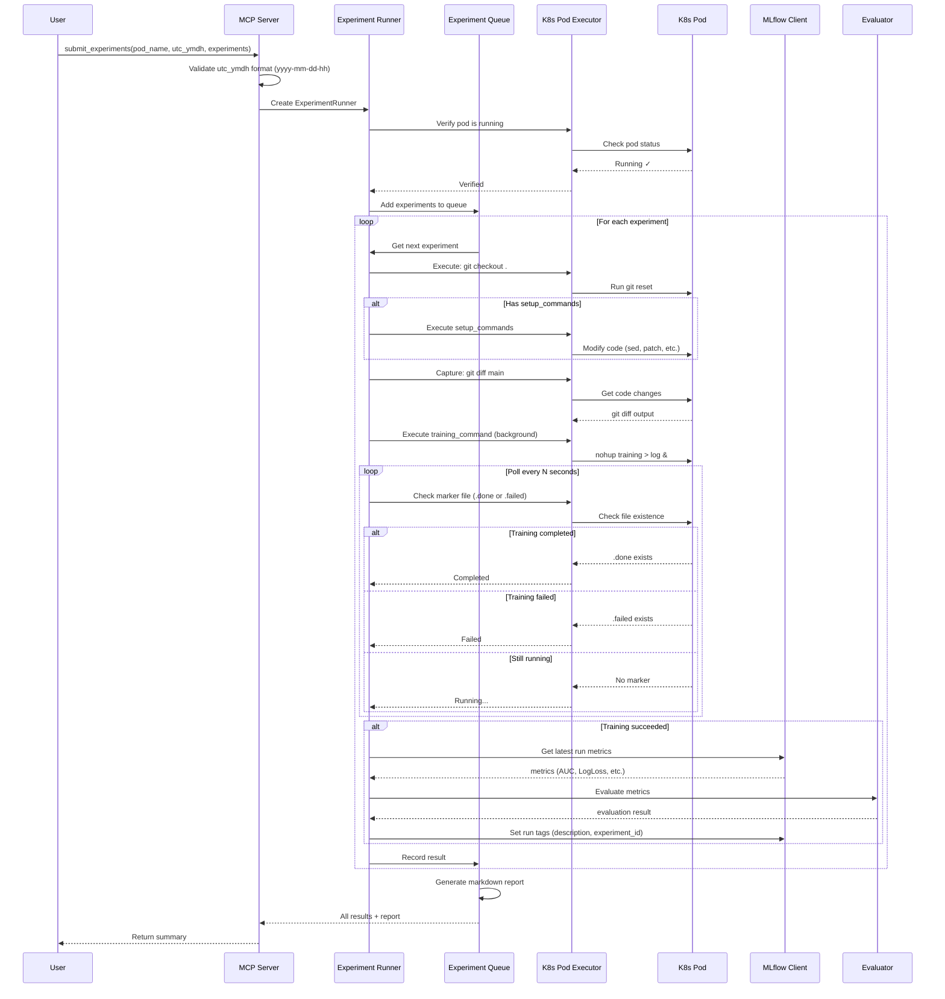
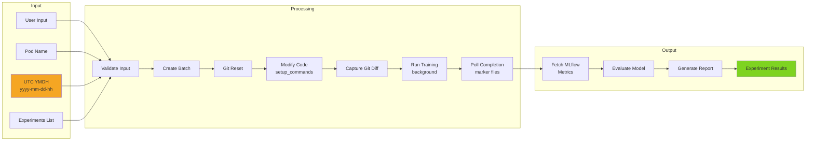
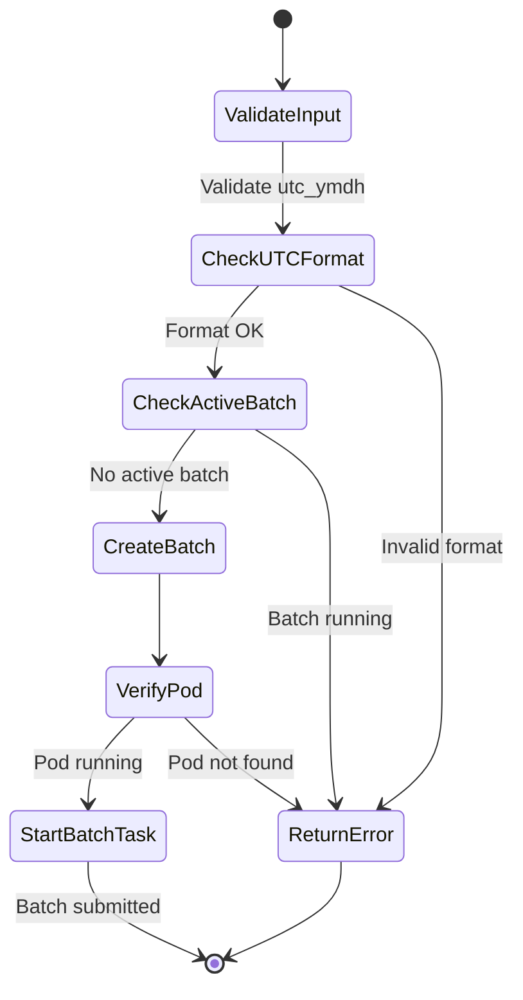

# AI Research Agent - Experiment Queue Manager

실행 중인 K8s Pod에서 ML 모델 학습 실험을 순차적으로 실행하고, MLflow에 결과를 기록하는 MCP 서버입니다.

## Features

- **실험 큐 관리**: 여러 실험을 순차적으로 실행
- **K8s Pod 활용**: 이미 실행 중인 Pod에서 학습 명령어 실행
- **코드 수정 자동화**: 각 실험마다 자동으로 git reset → 코드 수정 → git diff 기록
- **MLflow 연동**: 실험 메트릭 자동 수집 및 태그 기록
- **자동 평가**: AUC, LogLoss, Calibration Error 기반 모델 평가
- **모델 탐색 도구**: 모델별 코드 위치 동적 검색
- **마크다운 리포트**: 실험 결과 자동 리포트 생성

## System Architecture



## Experiment Execution Flow



## Data Flow



## Quick Start

### 1. 설치

```bash
curl -LsSf https://astral.sh/uv/install.sh | sh
uv sync
```

### 2. 환경 설정

```bash
cp .env.example .env
# MLFLOW_TRACKING_URI, K8S_NAMESPACE 설정
```

### 3. MCP 서버 실행

```bash
uv run python -m src.mcp.server
```

## MCP Tools

| Tool | Description | Parameters |
|------|-------------|------------|
| `submit_experiments` | 실험 배치 제출 | `pod_name`, `utc_ymdh` (yyyy-mm-dd-hh), `experiments[]`, `mlflow_experiment_name`, `stop_on_failure`, `poll_interval` |
| `get_queue_status` | 큐 상태 확인 (현재 실행 중인 실험, pending/completed 개수) | - |
| `get_experiment_results` | 결과 조회 (메트릭, 평가, 마크다운 리포트) | `batch_id` (optional) |
| `stop_batch` | 진행 중인 배치 중단 | - |
| `get_modification_guide` | 모델별 코드 위치 동적 검색 (optimizer, feature, hyperparameter 등) | `pod_name`, `model_name`, `intent`, `repo_path`, `context_lines` |
| `list_models` | 사용 가능한 모델 목록 조회 (whisky_v1, vodka_v3) | `pod_name`, `product`, `repo_path` |

### Tool 사용 예시

#### 1. 실험 제출

```python
await submit_experiments(
    pod_name="my-training-pod",
    utc_ymdh="2026-02-06-00",  # MUST be yyyy-mm-dd-hh format
    experiments=[
        {
            "description": "Baseline model",
            "training_command": "cd /app && python train.py --utc_ymdh '{utc_ymdh}'"
        },
        {
            "description": "Remove content_landing features",
            "setup_commands": "cd /app && sed -i '/content_landing/s/^/# /' conf.py",
            "training_command": "cd /app && python train.py --utc_ymdh '{utc_ymdh}'"
        },
    ],
    mlflow_experiment_name="my-experiment",
    poll_interval=600  # Check every 10 minutes
)
```

#### 2. 모델 코드 위치 검색

```python
# Find optimizer configuration for a specific model
await get_modification_guide(
    pod_name="my-training-pod",
    model_name="zigzag_conv_mtl12",
    intent="optimizer"  # or: lr_scheduler, feature, hyperparameter, etc.
)
```

#### 3. 모델 목록 조회

```python
# List all available models
await list_models(
    pod_name="my-training-pod",
    product="all"  # or: whisky_v1, vodka_v3
)
```

## Project Structure

```
ai-research-agent/
├── src/
│   ├── core/                      # 설정 및 데이터 모델
│   │   ├── config.py             # Settings (MLflow URI, K8s namespace, thresholds)
│   │   └── models.py             # ExperimentConfig, ExperimentResult, ExperimentBatch
│   ├── experiment/                # 실험 큐 및 러너
│   │   ├── queue.py              # ExperimentQueue (FIFO queue management)
│   │   ├── runner.py             # ExperimentRunner (orchestrates execution)
│   │   └── report_generator.py  # Markdown report generation
│   ├── evaluation/                # 모델 평가
│   │   └── evaluator.py          # Model evaluation (AUC, LogLoss, Calibration)
│   ├── integrations/              # MLflow 클라이언트
│   │   └── mlflow_client.py      # MLflow API wrapper
│   ├── k8s/                       # K8s Pod 실행
│   │   └── pod_executor.py       # Execute commands on K8s pods via kubectl
│   └── mcp/                       # MCP 서버
│       └── server.py              # FastMCP server with 6 tools
└── tests/
    ├── unit/
    └── integration/
```

## Component Details

### Core Components

#### 1. MCP Server (`src/mcp/server.py`)
- FastMCP 기반 MCP 서버
- 6개 tool 제공
- Global state 관리 (active batch, runner, task)
- Intent patterns for code search (optimizer, feature, etc.)

#### 2. Experiment Runner (`src/experiment/runner.py`)
- 실험 오케스트레이션
- 각 실험마다:
  1. Git reset (`git checkout .`)
  2. Setup commands 실행 (코드 수정)
  3. Git diff 캡처
  4. Training command 백그라운드 실행 (nohup)
  5. Marker file 기반 완료 polling (.done/.failed)
  6. MLflow metrics 수집
  7. 평가 수행

#### 3. Experiment Queue (`src/experiment/queue.py`)
- AsyncIO queue 기반 FIFO 큐
- Result tracking
- Summary 생성
- Markdown report 생성 위임

#### 4. Pod Executor (`src/k8s/pod_executor.py`)
- Kubernetes API 클라이언트
- `kubectl exec` 래퍼
- Pod 상태 확인
- 스크립트 실행

#### 5. MLflow Client (`src/integrations/mlflow_client.py`)
- MLflow Tracking API 래퍼
- Latest run metrics 조회
- Run tags 설정
- Experiment/run 생성

#### 6. Model Evaluator (`src/evaluation/evaluator.py`)
- Threshold 기반 평가
- Score 계산 (0-100)
- Pass/fail 판정

## Experiment Workflow Detail

### 1. Experiment Submission



### 2. Single Experiment Execution

Each experiment goes through:

1. **Cleanup**: Remove old marker files and logs
2. **Reset**: `git checkout .` - clean state
3. **Setup** (optional): Run setup_commands (sed, patch, etc.)
4. **Capture**: `git diff main` - record changes
5. **Train**: Execute training_command in background
   - Use heredoc to create training script (avoid quote escaping)
   - Run with `nohup` and redirect to log file
   - Create `.done` or `.failed` marker on completion
6. **Poll**: Check marker files every `poll_interval` seconds
7. **Collect**: Fetch MLflow metrics (if training succeeded)
8. **Evaluate**: Run evaluator on metrics
9. **Tag**: Set MLflow run tags (description, experiment_id)
10. **Record**: Save result to queue

### 3. utc_ymdh Format Validation

**REQUIRED FORMAT**: `yyyy-mm-dd-hh` (e.g., `2026-02-06-00`)

Validation regex: `^\d{4}-\d{2}-\d{2}-\d{2}$`

**Examples**:
- ✅ `2026-02-06-00`
- ✅ `2025-12-31-23`
- ❌ `2026020600` (old format, rejected)
- ❌ `2026-02-06` (missing hour)
- ❌ `26-02-06-00` (2-digit year)

## Model Code Search

The `get_modification_guide` tool dynamically searches for code locations based on intent:

### Supported Intents

| Intent | Pattern | Examples |
|--------|---------|----------|
| `optimizer` | `optimizer\|Optimizer\|OPTIMIZER\|optim\.` | `optimizer = Adam`, `OPTIMIZER = 'sgd'` |
| `lr_scheduler` | `scheduler\|lr_schedule\|learning_rate\|warmup` | `LR_SCHEDULER`, `warmup_steps` |
| `feature` | `feature\|FEATURE\|feature_list\|feat_` | `FEATURE_LIST`, `feat_content` |
| `hyperparameter` | `hidden\|dropout\|batch_size\|embed_dim` | `HIDDEN_UNITS`, `DROPOUT`, `BATCH_SIZE` |
| `preprocessing` | `preprocess\|transform\|normalize` | `def preprocess()`, `_prep_data` |
| `model_structure` | `class.*Model\|def forward\|nn\.Module` | `class MyModel(nn.Module)` |
| `loss` | `loss\|Loss\|criterion\|bce\|cross_entropy` | `criterion = BCELoss()` |
| `regularization` | `weight_decay\|l1_reg\|l2_reg` | `WEIGHT_DECAY = 0.01` |

### Model Structure Support

Supports both product architectures:

- **whisky_v1**: `{model}/conf.py` + `common/nn/{model}/*.py`
- **vodka_v3**:
  - Internal: `internal/per_country/{model}/`
  - External: `external/per_ssp/{model}/`
  - Common: `common/nn_v2/{mtl_version}/`

## Evaluation Criteria

| Metric | Threshold | Condition | Weight |
|--------|-----------|-----------|--------|
| AUC | 0.85 | > threshold | 50% |
| LogLoss | 0.35 | < threshold | 30% |
| Calibration Error | 0.02 | < threshold | 20% |

### Score Calculation

```python
auc_score = (auc - 0.5) * 2           # Normalize to 0-1
logloss_score = 1 - logloss            # Lower is better
calibration_score = 1 - cal_error * 10 # Lower is better

final_score = (
    auc_score * 0.5 +
    logloss_score * 0.3 +
    calibration_score * 0.2
) * 100  # Scale to 0-100
```

## Configuration

### Environment Variables

```bash
# MLflow Configuration
MLFLOW_TRACKING_URI=http://mlflow.ai.svc.cluster.local:5000

# Kubernetes Configuration
K8S_NAMESPACE=tf-box

# Logging
LOG_LEVEL=INFO

# Evaluation Thresholds
MODEL_AUC_THRESHOLD=0.85
MODEL_LOGLOSS_THRESHOLD=0.35
MODEL_CALIBRATION_ERROR_THRESHOLD=0.02
```

## Development

```bash
# 테스트
uv run pytest

# 린트
uv run ruff check .

# 포맷
uv run ruff format .
```

## Error Handling

### Common Errors

1. **Invalid utc_ymdh format**
   ```
   Error: Invalid utc_ymdh format: '2026020600'.
   Expected format: 'yyyy-mm-dd-hh' (예: '2026-02-06-00')
   ```

2. **Pod not running**
   ```
   Error: Pod 'my-pod' is not running (status: Pending)
   ```

3. **Batch already running**
   ```
   Error: A batch is already running. Use stop_batch() first.
   ```

4. **MLflow not available**
   ```
   Warning: MLflow not available, returning empty metrics
   ```

## Best Practices

1. **Always use yyyy-mm-dd-hh format** for utc_ymdh
2. **Verify pod is running** before submitting experiments
3. **Use setup_commands** for code modifications instead of manual editing
4. **Set appropriate poll_interval** based on training duration (default: 600s)
5. **Check queue_status** periodically to monitor progress
6. **Review markdown report** for comprehensive analysis

## Links

- [FastMCP Documentation](https://github.com/jlowin/fastmcp)
- [Model Context Protocol](https://modelcontextprotocol.io/)
- [MLflow Documentation](https://mlflow.org/)
- [Kubernetes Python Client](https://github.com/kubernetes-client/python)

## License

MIT
